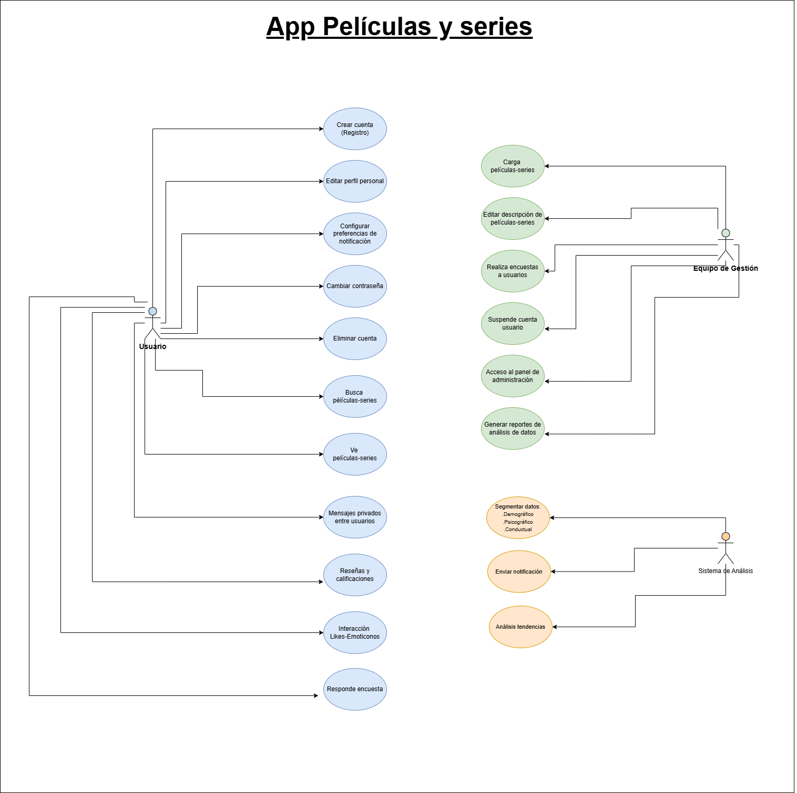

# peliser-movies-series

## Definición del proyecto:

**El proyecto se basa en películas y series, así como sus valoraciones y reseñas por parte de los usuarios.**

   - **Título**: Nombre de la película o serie.
   - **Género**: Clasificación (acción, drama, comedia, etc.).
   - **Sinopsis**: Breve resumen de la trama.
   - **Equipo Creativo**: Directores, guionistas, productores y actores principales.
   - **Duración**: Tiempo total de la película o episodios.

### 1. **Análisis del contexto**
   - **Contexto de Producción**: Presupuesto, estudio o plataforma de lanzamiento (Netflix, HBO, etc.).
   - **Fecha de Estreno**: Importancia del momento en que se lanza (temporada, competencia).

### 2. **Valoraciones de Usuarios**
   - **Calificaciones**: Análisis de puntuaciones en plataforma.
   - **Reseñas**: Resumen de comentarios de los usuarios, resaltando aspectos positivos y negativos.
   - **Segmentación de datos**: Quiénes son los espectadores (edad, género, ubicación etc.).

### 3. **Análisis de Tendencias**
   - **Temáticas Comunes**: Identificación de temas recurrentes en la narrativa.
   - **Reacción Crítica**: Opiniones de críticos de cine y televisión.
   - **Comparativa**: Comparación con proyectos similares en términos de éxito y recepción.

### 4. **Impacto Cultural**
   - **Influencia en la Sociedad**: Cómo ha afectado o reflejado tendencias sociales.
   - **Premios y Reconocimientos**: Nominaciones y premios recibidos.

### 5. **Conclusiones**
   - **Éxitos y Fracasos**: Evaluación del rendimiento global del proyecto.
   - **Lecciones Aprendidas**: Qué se puede mejorar en futuros proyectos.

 

Este enfoque permite una comprensión más profunda de cada serie-película y cómo se percibe en el contexto actual de los usuarios y al tener en cuenta que al implementar un sistema de gestión interactivo y centrado en el usuario, el proyecto puede obtener insights valiosos sobre cómo las películas y series son recibidas y valoradas por la audiencia, facilitando mejoras continuas y la adaptación a las tendencias del mercado. Esto puede ser esencial para el desarrollo de futuros proyectos y la fidelización de la audiencia.

 
 

 
 

Autor: 
**materancode**

 

## | Especificación de Actores y Operaciones

### Actores

* **Usuario**
   * *Descripción:* Usuario con permiso de registrarse, interactuar con otros usuarios, realizar encuestas, hacer valoraciones y reseñas además de sugerir que se añadan películas-series.

* **Equipo de gestión**
   * *Descripción:* El equipo añade películas-series, prepara encuestas y actualiza el contenido de las películas-series.

   * **Sistema**
      * *Descripción:* El sistema realiza análisis demográfico y de datos.

      ## Operaciones por Actor

**Usuario Registrado**

- i.    Crear cuenta de usuario.
- ii.   Iniciar sesión en la aplicación.
- iii.  Editar su perfil.
- iv.   Comentar sus opiniones y valoraciones de las películas-series.
- v.    Enviar mensajes a otros usuarios (interacción sobre el contenido).
- vi.   Solicitar cambio de contraseña.
- vii.  Configurar preferencias de notificación.
- viii.  Eliminar cuenta.
- ix.   interacción con likes y emoticonos entre usuarios.

 

**Gestión de contenido**

- i.     Cargar películas-series.
- ii.    Crear y editar descripción de películas-series.
- iii.  Realizar encuestas a los usuarios.
- iv.   Realizar cuestionanrios a los usuarios.
- v.    Suspender cuenta de usuario.
- vi.   Acceso al panel de administración.
- vii.  Generar reportes de análisis de usuarios.
- viii. Modificar configuraciones de la aplicación.

 

**Sistema de análisis**

- i.     Recolectar datos de segmentación.
- ii.    Segmentar datos de audiencia.
- iii.   Analizar datos de audiencia para conocer tendencias y generar reportes.
- iv.    Notificar usuarios.
- v.     Notificar Gestores del contenido.

 

|  Actor | XXX (Usuario) |
|---|---|
| Descripción  | _El usuario realiza valoraciones del contenido, realiza encuestas y tambien interactúa con otros usuarios_  |
| Características  | _Realiza valoraciones en función de su percepción del contenido y sugiere contenido de interés_ |
| Relaciones | _Los usuarios se relacionan entre sí._  |
| Referencias | _Interactúa con su cuenta y con otros usuarios, sugiere contenido y realiza valoraciones y reseñas del contenido_ |   
|  Notas |  _Se realiza el enfoque en el contenido que quiere ver el usuario en función de sus preferencias_ |
| Autor  | _materancode_ |
|Fecha | _12-11-2024_ |

|  Atributo |||
|---|---|---|
| _Usuario_  | _Realiza valoraciones_  | _Contenido_ |
| | |

 

|  Actor | XXX (Equipo de gestión) |
|---|---|
| Descripción  | _Evalúa los reportes del sistema para generar el contenido ideal para el usuario_  |
| Características  | _Carga contenido sugerido por los usuarios y que esten en tendencias además de crear encuetas_ |
| Relaciones | __  |
| Referencias | _Carga contenido, edita contenido y descrpción, crea encuestas, tiene acceso al panel de administración_ |   
|  Notas |  _Se realizan análisis de las preferencias del usuario_ |
| Autor  | _materancode_ |
|Fecha | _12-11-2024_ |

|  Atributo |||
|---|---|---|
| _Equipo de gestión_  | _Analiza preferencias_  | _Usuario_ |
| | |

 

|  Actor | XXX (Sistema) |
|---|---|
| Descripción  | _Genera reportes, analiza tendencias y envía notificaciones _  |
| Características  | _Conocer tendencias, usuarios y preferencias del mismo_ |
| Relaciones | __  |
| Referencias | _Segmentación de datos para conocer preferencias del usuario, enviar notificaciones y analizar tendencias_ |   
|  Notas |  __ |
| Autor  | _materancode_ |
|Fecha | _12-11-2024_ |

|  Atributo |||
|---|---|---|
| _Sistema_  | _Análisis_  | _Tendencias-Usuario_ |
| | |

## Casos de Uso Usuario
 

|  	CU | XX Crear Cuenta    |
  |---|---|
  | Fuentes  | _Consumir contenido aportado por la app_  |
  | Actor  |  _Usuario_ |
  | Descripción | _Se registra en la app_  |
  | Flujo básico | __ |
  | Pre-condiciones | _Correo electrónico_  |  
  | Post-condiciones  | _Buscar, ver y calificar contenido_  |  
  |  Requerimientos | _Correo electrónico_  |
  |  Notas |  __ |
  | Autor  | _materancode_ |
  |Fecha | _12-11-2024_ |

 

|  	CU | XX Editar perfil    |
  |---|---|
  | Fuentes  | _Estética_  |
  | Actor  |  _Usuario_ |
  | Descripción | _Se selecciona la estética de preferencia_  |
  | Flujo básico | __ |
  | Pre-condiciones | _Correo electrónico_  |  
  | Post-condiciones  | _Buscar, ver y calificar contenido_  |  
  |  Requerimientos | _Correo electrónico_  |
  |  Notas |  __ |
  | Autor  | _materancode_ |
  |Fecha | _12-11-2024_ |

 

|  	CU | XX Configurar preferencias de notificación    |
  |---|---|
  | Fuentes  | _Funciones de notificación_  |
  | Actor  |  _Usuario_ |
  | Descripción | _Se selecciona la opción de preferencia_  |
  | Flujo básico | __ |
  | Pre-condiciones | _Correo electrónico_  |  
  | Post-condiciones  | _Buscar, ver y calificar contenido_  |  
  |  Requerimientos | _Correo electrónico_  |
  |  Notas |  __ |
  | Autor  | _materancode_ |
  |Fecha | _12-11-2024_ |

 

|  	CU | XX Cambiar contraseña     |
  |---|---|
  | Fuentes  | _Olvidó contraseña_  |
  | Actor  |  _Usuario_ |
  | Descripción | _Modifica contraseña autentificandose_  |
  | Flujo básico | __ |
  | Pre-condiciones | _Correo electrónico_  |  
  | Post-condiciones  | _Buscar, ver y calificar contenido_  |  
  |  Requerimientos | _Correo electrónico_  |
  |  Notas |  __ |
  | Autor  | _materancode_ |
  |Fecha | _12-11-2024_ |

 

|  	CU | XX Eliminar cuenta     |
  |---|---|
  | Fuentes  | _No usar más cuenta_  |
  | Actor  |  _Usuario_ |
  | Descripción | _No podrá usar mas su cuenta_  |
  | Flujo básico | __ |
  | Pre-condiciones | _Correo electrónico_  |  
  | Post-condiciones  | __  |  
  |  Requerimientos | __  |
  |  Notas |  __ |
  | Autor  | _materancode_ |
  |Fecha | _12-11-2024_ |

 

|  	CU | XX  Buscar películas-series     |
  |---|---|
  | Fuentes  | _Buscador y librería de contenido_  |
  | Actor  |  _Usuario_ |
  | Descripción | _Se realiza búsqueda de preferencia_  |
  | Flujo básico | __ |
  | Pre-condiciones | _Correo electrónico_  |  
  | Post-condiciones  | _ver y calificar contenido_  |  
  |  Requerimientos | _Correo electrónico_  |
  |  Notas |  __ |
  | Autor  | _materancode_ |
  |Fecha | _12-11-2024_ |

 

|  	CU | XX  Ver películas-series    |
  |---|---|
  | Fuentes  | _Consúmo de contenido_  |
  | Actor  |  _Usuario_ |
  | Descripción | _Selecciona el contenido que desea ver_  |
  | Flujo básico | __ |
  | Pre-condiciones | _Correo electrónico_  |  
  | Post-condiciones  | _ver y calificar contenido_  |  
  |  Requerimientos | _Correo electrónico_  |
  |  Notas |  __ |
  | Autor  | _materancode_ |
  |Fecha | _12-11-2024_ |

 

|  	CU | XX  Mensajes privados entre usuarios    |
  |---|---|
  | Fuentes  | _Chat entre usuarios_  |
  | Actor  |  _Usuario_ |
  | Descripción | _Interacción de los usuarios en DM_  |
  | Flujo básico | __ |
  | Pre-condiciones | _Correo electrónico_  |  
  | Post-condiciones  | _Buscar, ver y calificar contenido_  |  
  |  Requerimientos | _Correo electrónico_  |
  |  Notas |  __ |
  | Autor  | _materancode_ |
  |Fecha | _12-11-2024_ |

 

|  	CU | XX  Reseñas y calificaciones   |
  |---|---|
  | Fuentes  | _Valoración del contenido_  |
  | Actor  |  _Usuario_ |
  | Descripción | _Dar opiniones sobre el contenido y calificarlo_  |
  | Flujo básico | __ |
  | Pre-condiciones | _Correo electrónico_  |  
  | Post-condiciones  | _Buscar, ver y calificar contenido_  |  
  |  Requerimientos | _Correo electrónico_  |
  |  Notas |  __ |
  | Autor  | _materancode_ |
  |Fecha | _12-11-2024_ |

   

|  	CU | XX  Interacción con likes-emoticons  |
  |---|---|
  | Fuentes  | _Comentarios entre usuarios_  |
  | Actor  |  _Usuario_ |
  | Descripción | _Se dan likes-emoticons a los comentarios_  |
  | Flujo básico | __ |
  | Pre-condiciones | _Correo electrónico_  |  
  | Post-condiciones  | _Buscar, ver y calificar contenido_  |  
  |  Requerimientos | _Correo electrónico_  |
  |  Notas |  __ |
  | Autor  | _materancode_ |
  |Fecha | _12-11-2024_ |

   

|  	CU | XX  Responde encuestas  |
  |---|---|
  | Fuentes  | _Calificaciones del contenido y aportación de mejoras_  |
  | Actor  |  _Usuario_ |
  | Descripción | _Se dan opciones a seleccionar y comentarios breves para aumentar las mejoras de la app_  |
  | Flujo básico | __ |
  | Pre-condiciones | _Correo electrónico_  |  
  | Post-condiciones  | _Buscar, ver y calificar contenido_  |  
  |  Requerimientos | _Correo electrónico_  |
  |  Notas |  __ |
  | Autor  | _materancode_ |
  |Fecha | _12-11-2024_ |

  ## Casos de Uso Equipo de gestión
 

|  	CU | XX Carga películas-series    |
  |---|---|
  | Fuentes  | _Carga de contenido de preferencia del usuario_  |
  | Actor  |  _Equipo de gestión_ |
  | Descripción | _Subir contenido_  |
  | Flujo básico | __ |
  | Pre-condiciones | _Correo electrónico_  |  
  | Post-condiciones  | __  |  
  |  Requerimientos | _Correo electrónico_  |
  |  Notas |  __ |
  | Autor  | _materancode_ |
  |Fecha | _12-11-2024_ |

   

|  	CU | XX Editar descripción de películas-series   |
  |---|---|
  | Fuentes  | _Presentaciónes del contenido para el usuario_  |
  | Actor  |  _Equipo de gestión_ |
  | Descripción | _Edición de las descripciones del contenido_  |
  | Flujo básico | __ |
  | Pre-condiciones | _Correo electrónico_  |  
  | Post-condiciones  | __  |  
  |  Requerimientos | _Correo electrónico_  |
  |  Notas |  __ |
  | Autor  | _materancode_ |
  |Fecha | _12-11-2024_ |

  
   

|  	CU | XX Realiza encuestas a usuarios   |
  |---|---|
  | Fuentes  | _Mejorar contenido de usuario_  |
  | Actor  |  _Equipo de gestión_ |
  | Descripción | _Crear encuestas para análisis de usuario_  |
  | Flujo básico | __ |
  | Pre-condiciones | _Correo electrónico_  |  
  | Post-condiciones  | __  |  
  |  Requerimientos | _Correo electrónico_  |
  |  Notas |  __ |
  | Autor  | _materancode_ |
  |Fecha | _12-11-2024_ |
  

 

|  	CU | XX Suspende cuenta usuario   |
  |---|---|
  | Fuentes  | _Sancionar usuarios que no cumplan la política de la app_  |
  | Actor  |  _Equipo de gestión_ |
  | Descripción | _Se eliminan o suspenden cuentas de usuario_  |
  | Flujo básico | __ |
  | Pre-condiciones | _Correo electrónico_  |  
  | Post-condiciones  | __  |  
  |  Requerimientos | _Correo electrónico_  |
  |  Notas |  __ |
  | Autor  | _materancode_ |
  |Fecha | _12-11-2024_ |
  
   

|  	CU | XX Acceso al panel de administración   |
  |---|---|
  | Fuentes  | _Configuraciónes_  |
  | Actor  |  _Equipo de gestión_ |
  | Descripción | _Configuraciones no-definidas_  |
  | Flujo básico | __ |
  | Pre-condiciones | _Correo electrónico_  |  
  | Post-condiciones  | __  |  
  |  Requerimientos | _Correo electrónico_  |
  |  Notas |  __ |
  | Autor  | _materancode_ |
  |Fecha | _12-11-2024_ |
  

 

|  	CU | XX Generar reportes de análisis de datos   |
  |---|---|
  | Fuentes  | _Datos segmentados del sistema_  |
  | Actor  |  _Equipo de gestión_ |
  | Descripción | _Cada cierto tiempo generan reportes_  |
  | Flujo básico | __ |
  | Pre-condiciones | _Correo electrónico_  |  
  | Post-condiciones  | __  |  
  |  Requerimientos | _Correo electrónico_  |
  |  Notas |  __ |
  | Autor  | _materancode_ |
  |Fecha | _12-11-2024_ |
  

   ## Casos de Uso Sistema
 

|  	CU | XX Segmentar datos    |
  |---|---|
  | Fuentes  | _Segmentación_  |
  | Actor  |  _Sistema_ |
  | Descripción | _Análisis y recopilador de datos_  |
  | Flujo básico | __ |
  | Pre-condiciones | __  |  
  | Post-condiciones  | __  |  
  |  Requerimientos | __  |
  |  Notas |  __ |
  | Autor  | _materancode_ |
  |Fecha | _12-11-2024_ |

   

|  	CU | XX Enviar notificación    |
  |---|---|
  | Fuentes  | _Notificar usuarios y equipo de gestión_  |
  | Actor  |  _Sistema_ |
  | Descripción | _Notificar mensajes e interacciones entre usuarios, contenido nuevo para usuarios, y avisar al equipo de gestión de los reportes generados_  |
  | Flujo básico | __ |
  | Pre-condiciones | __  |  
  | Post-condiciones  | __  |  
  |  Requerimientos | __  |
  |  Notas |  __ |
  | Autor  | _materancode_ |
  |Fecha | _12-11-2024_ |

    

|  	CU | XX Análisis de tendencias    |
  |---|---|
  | Fuentes  | _Analizar datos_  |
  | Actor  |  _Sistema_ |
  | Descripción | _Datos en tendencias analizar y recopilar información_  |
  | Flujo básico | __ |
  | Pre-condiciones | __  |  
  | Post-condiciones  | __  |  
  |  Requerimientos | __  |
  |  Notas |  __ |
  | Autor  | _materancode_ |
  |Fecha | _12-11-2024_ |

     
   ├── docs/
   │   ├── requisitos/
   │   │   ├── especificacion_requisitos.md
   │   │   ├── casos_uso.md
   │   │   └── backlog.md
   │   ├── diseno/
   │   │   ├── diagramas/
   │   │   │   ├──
   │   │   │   ├── diagrama_secuencia.png
   │   │   │   ├── 
   │   │   │   ├── 
   │   │   │   
   │   │   └── arquitectura.md
   │   ├── planificacion/
   │   │   ├── Definición del proyecto.md
   │   │   ├── Especificación actores.md
   │   │   └── Operaciones.md
   └── README.md

