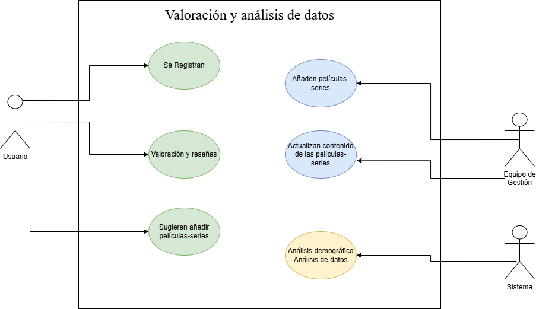

# peliser-movies-series

## Definición del proyecto:

**El proyecto se basa en películas y series, así como sus valoraciones por parte de los usuarios.**

### 1. **Definición del Proyecto**
   - **Título**: Nombre de la película o serie.
   - **Género**: Clasificación (acción, drama, comedia, etc.).
   - **Sinopsis**: Breve resumen de la trama.
   - **Equipo Creativo**: Directores, guionistas, productores y actores principales.
   - **Duración**: Tiempo total de la película o episodios.

### 2. **Análisis del Contexto**
   - **Contexto de Producción**: Presupuesto, estudio o plataforma de lanzamiento (Netflix, HBO, etc.).
   - **Fecha de Estreno**: Importancia del momento en que se lanza (temporada, competencia).

### 3. **Valoraciones de Usuarios**
   - **Calificaciones**: Análisis de puntuaciones en plataforma.
   - **Reseñas**: Resumen de comentarios de los usuarios, resaltando aspectos positivos y negativos.
   - **Demografía del Público**: Quiénes son los espectadores (edad, género, ubicación).

### 4. **Análisis de Tendencias**
   - **Temáticas Comunes**: Identificación de temas recurrentes en la narrativa.
   - **Reacción Crítica**: Opiniones de críticos de cine y televisión.
   - **Comparativa**: Comparación con proyectos similares en términos de éxito y recepción.

### 5. **Impacto Cultural**
   - **Influencia en la Sociedad**: Cómo ha afectado o reflejado tendencias sociales.
   - **Premios y Reconocimientos**: Nominaciones y premios recibidos.

### 6. **Conclusiones**
   - **Éxitos y Fracasos**: Evaluación del rendimiento global del proyecto.
   - **Lecciones Aprendidas**: Qué se puede mejorar en futuros proyectos.

 

Este enfoque permite una comprensión más profunda de cada serie-película y cómo se percibe en el contexto actual de los usuarios y al tener en cuenta que al implementar un sistema de gestión interactivo y centrado en el usuario, el proyecto puede obtener insights valiosos sobre cómo las películas y series son recibidas y valoradas por la audiencia, facilitando mejoras continuas y la adaptación a las tendencias del mercado. Esto puede ser esencial para el desarrollo de futuros proyectos y la fidelización de la audiencia.

 
 

 
 

Autor: 
**materancode**

 

## | Especificación de Actores y Operaciones

### Actores

* **Usuario**
   * *Descripción:* Usuario con permiso de registrarse, hacer valoraciones y reseñas además de sugerir que se añadan películas-series.

* **Equipo de gestión**
   * *Descripción:* El equipo añade películas-series y actualiza el contenido de las películas-series.

   * **Sistema**
      * *Descripción:* El sistema realiza análisis demográfico y de datos.

      ## Operaciones por Actor

**Usuario Registrado**

- i.    Crear cuenta de usuario.
 
- ii.   Iniciar sesión en la aplicación.

- iii.  Editar su perfil.
- iv.   Comentar sus opiniones y valoraciones de las películas-series.
- v.    Enviar mensajes a otros usuarios (interacción sobre el contenido).
- vi.   Solicitar cambio de contraseña.
- vii.  Configurar preferencias de notificación.
- viii.  Eliminar cuenta.
- ix.   interacción con likes y emoticonos entre usuarios.

 

**Gestión de contenido**

- i.     Cargar películas-series.
 
- ii.    Crear y editar descripción de películas-series.

- iii.  Realizar encuestas a los usuarios.
- iv.   Realizar cuestionanrios a los usuarios.
- v.    Suspender cuenta de usuario.
- vi.   Acceso al panel de administración.
- vii.  Generar reportes de análisis de usuarios.
- viii. Modificar configuraciones de la aplicación.

 

**Sistema de análisis**

- i.     Recolectar datos demográficos.
 
- ii.    Segmentar datos de audiencia.

- iii.   Analizar datos de audiencia para conocer tendencias.
- iv.    Notificar usuarios.
- v.     Notificar Gestores del contenido.

